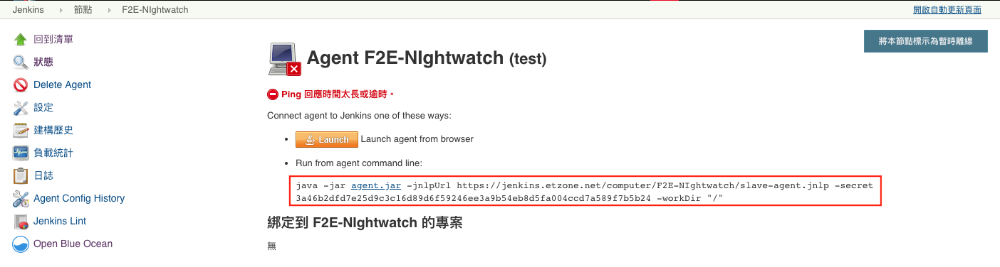

#F2E-UnitTest
##How to Use
###安裝docker
yum install -y docker
###建立docker image
docker build -t jest-node .
###建立container
docker run -d -it jest-node bash  
或  
docker run -d -it jest-node java -jar agent.jar -jnlpUrl... 
###備註
command:  docker build [OPTION] PATH  
-t jest-node:標註docker image的名稱和jest-node
.:意即dockerfile位於當前資料夾  
  
    
command:  docker run [OPTION] IMAGE COMMAND  
-d: container建立後在背景執行  
-it:  container建立一個互動式介面  
jest-node:  image名稱，如果找不到jest-noe需要先執行docker build的指令，或是改拉線上的image: tainenko/jest-node  
COMMAND: bash 進入linux交互介面、java -jar agent.jar -jnlpUrl... 該指令為jenkins新增slave的command，需要自行替換為真實的jenkins agent command

